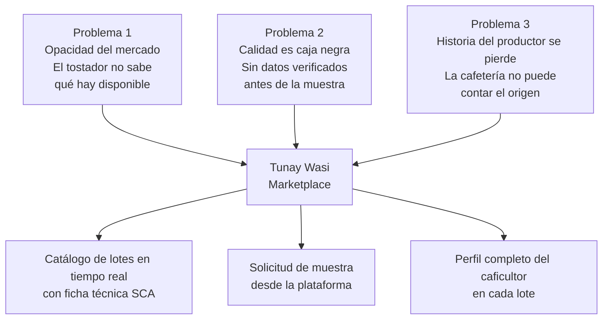
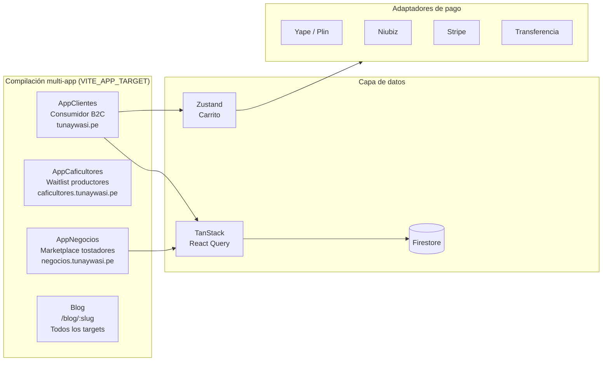

# Tunay Wasi — MVP del Marketplace de Café de Especialidad

**Tunay Wasi** es el primer marketplace B2B de café verde de especialidad peruano. Conecta directamente a caficultores con tostadores y cafeterías de especialidad, resolviendo los tres problemas críticos que mantienen el mercado opaco, fragmentado y roto estacionalmente.

---

## El Problema que Resolvemos

El mercado de café de especialidad peruano opera íntegramente a través de redes telefónicas informales. Los tostadores manejan 3 o más proveedores porque ninguno garantiza continuidad. La calidad es imposible de verificar antes de comprar. Y cada enero–febrero el mercado se queda sin café — no porque el café no exista, sino porque nadie conectó la cosecha de junio–agosto con quien la necesitaba en enero.

Tres problemas. Una plataforma.



---

## Las 3 Soluciones

### Solución 1 — Visibilidad del Mercado en Tiempo Real

> *"Platform Revolution" (Parker et al., 2016): los negocios más valiosos del siglo XXI no producen cosas — crean visibilidad del mercado.*

| Antes de Tunay Wasi | Con Tunay Wasi |
|---|---|
| Llamar a 3–5 proveedores para preguntar qué hay | Ver todos los lotes disponibles en un catálogo |
| Sin datos de disponibilidad futura | Lotes en preventa con fechas de entrega fijas |
| Escasez estacional sorpresiva en enero | Reservar la cosecha de agosto antes de que se agote |
| Cada negociación es manual y privada | Precio listado por lote, comparable en 30 segundos |

**Cómo funciona:** Cada lote que registra un caficultor aparece en el marketplace con variedad, proceso, región, altitud, peso disponible, precio/kg y fecha de cosecha. Tostadores y cafeterías navegan, filtran y solicitan muestras — todo desde la plataforma.

---

### Solución 2 — Señal de Calidad Antes de Comprometer Capital

> *"The Market for Lemons" (Akerlof, 1970): cuando el vendedor sabe más que el comprador sobre la calidad, el mercado colapsa hacia la mediocridad. Las señales de calidad verificables rompen la asimetría.*

| Antes de Tunay Wasi | Con Tunay Wasi |
|---|---|
| Calidad inverificable antes de comprar | Ficha técnica estandarizada en cada lote |
| El tostador asume todo el costo de evaluación | Solicitud de muestra desde la plataforma — 200g, gratis |
| El café de 88 pts del caficultor se vende como commodity | Puntaje SCA de referencia + catación del tostador registrada |
| Sin historial del desempeño anterior del lote | Historial de cataciones visible en el perfil del productor |

**Cómo funciona:** Cada lote publicado en Tunay Wasi incluye una ficha técnica documentada (variedad, proceso, altitud, método de secado, fecha de cosecha). El tostador solicita la muestra directamente desde la plataforma. Su resultado de catación puede registrarse y queda visible para las cafeterías que compran a ese tostador — convirtiendo la expertise del tostador en una señal de confianza para los compradores finales.

---

### Solución 3 — La Historia del Productor que Vende

> *"El Misterio del Capital" (De Soto, 2000): el productor rural tiene activos reales — tierra, variedad, proceso, historia — pero sin representación formal esos activos son capital muerto que el mercado no puede leer.*

| Antes de Tunay Wasi | Con Tunay Wasi |
|---|---|
| El caficultor vende anónimamente a través del acopiador | Productor con nombre y perfil de finca en cada lote |
| El tostador tiene variedad + proceso, pero no la historia | Coordenadas GPS, fotos de la finca, biografía |
| La cafetería no puede responder "¿quién lo cultivó?" | Narrativa completa lista para imprimir en la carta |
| El productor no tiene incentivo para mejorar la calidad | El diferencial de precio crea ese incentivo |

**Cómo funciona:** Cada lote está vinculado al perfil público del caficultor: nombre, finca, región, altitud, años de experiencia, especialidad en variedad y una historia curada en el lenguaje que sus compradores entienden. El tostador hereda ese contenido — no necesita escribir nada. La cafetería recibe la historia. El caficultor recibe el precio que merece su calidad.

---

## Arquitectura



> **Nota:** Tres SPAs independientes se compilan desde la misma codebase. Vite/Rollup hace tree-shaking de cada target en tiempo de compilación — los consumidores nunca descargan el código de los tostadores y viceversa. El blog es compartido entre todos los targets mediante rutas dinámicas.

---

## Stack Tecnológico

| Capa | Tecnología |
|---|---|
| Framework | React 18 + TypeScript |
| Build | Vite 5 — multi-target vía `VITE_APP_TARGET` |
| Estado | Zustand (carrito, persistido) + TanStack React Query (datos del servidor) |
| Validación | Zod |
| Base de datos | Firebase Firestore |
| Almacenamiento | Firebase Storage |
| Email | EmailJS (formulario de contacto, fallback WhatsApp) |
| Estilos | CSS plano — inline styles + design tokens (sin Tailwind) |
| Analítica | Google Analytics 4 + Meta Pixel (solo producción) |

---

## Targets de Compilación

| `VITE_APP_TARGET` | App | Archivo raíz | URL |
|---|---|---|---|
| sin definir / `clientes` | Landing B2C consumidor + carrito + checkout | `AppClientes.tsx` | tunaywasi.pe |
| `caficultores` | Waitlist de adquisición de productores B2B | `AppCaficultores.tsx` | caficultores.tunaywasi.pe |
| `negocios` | Marketplace B2B tostadores — catálogo + solicitud de muestra | `AppNegocios.tsx` | negocios.tunaywasi.pe |

Compartido entre todos los targets:
- `/blog` — Índice del blog (12 artículos, categorizados)
- `/blog/:slug` — Artículo individual

---

## Funcionalidades

| Funcionalidad | Target | Estado |
|---|---|---|
| Catálogo de lotes desde Firestore con stock en tiempo real | B2B Negocios | ✅ Activo |
| Cuenta regresiva del ciclo de preventa con fechas de entrega | B2C, B2B Negocios | ✅ Activo |
| Perfiles de caficultores con fotos de finca e historia | B2C, B2B Negocios | ✅ Activo |
| Carrito con persistencia Zustand + cálculo de envío | B2C | ✅ Activo |
| Checkout — Yape/Plin QR + subida de voucher | B2C | ✅ Activo |
| Checkout — Niubiz (tarjetas peruanas) | B2C | 🔧 Stub — integrar SDK real |
| Checkout — Stripe (tarjetas internacionales) | B2C | 🔧 Stub — integrar SDK real |
| Formulario de solicitud de muestra (tostador → lote) | B2B Negocios | ✅ Activo |
| Calculadora de precio basada en puntaje SCA | B2B Caficultores | 🔧 Hardcodeado — conectar a Firestore |
| Registro en waitlist de productores | B2B Caficultores | ✅ Activo |
| Blog con serie de investigación económica (12 artículos) | Todos los targets | ✅ Activo |
| Google Analytics 4 + Meta Pixel | Todos los targets | ✅ Solo producción |

---

## Estructura del Proyecto

```
src/
├── AppClientes.tsx          # Raíz B2C
├── AppCaficultores.tsx      # Raíz B2B productores
├── AppNegocios.tsx          # Raíz B2B tostadores
├── main.tsx                 # Bootstrap dinámico según VITE_APP_TARGET
├── components/
│   ├── cart/                # CartButton, CartDrawer
│   ├── decor/               # Hummingbird, GrainOverlay, ImageSlot
│   ├── layout/              # Nav, Footer
│   └── sections/            # Hero, Origen, Modelo
├── features/
│   ├── catalog/             # Hooks Firestore: useCatalog, useCaficultores,
│   │                        # useActiveCycle, useLandingConfig, catalogService
│   ├── cart/                # cartStore (Zustand), cartSchema, shippingRules,
│   │                        # useCartTotals
│   ├── checkout/            # Modal CheckoutGate, useCheckout,
│   │   └── adapters/        # niubizAdapter, stripeAdapter,
│   │                        # yapePlinAdapter, transferenciaAdapter
│   ├── caficultores/        # CafiNav, CafiHero, CafiCalculator,
│   │                        # CafiBeneficios, CafiLista, CafiFAQ
│   ├── negocios/            # SupplyNav, SupplyHero, SupplyLotes,
│   │                        # SupplyProceso, SupplyForm
│   ├── preventa/            # Countdown de preventa, useCountdown
│   └── contact/             # Formulario de contacto (EmailJS + fallback WA)
├── pages/
│   └── blog/                # BlogIndex, BlogPost
├── data/
│   └── blog/                # posts.ts (metadata), postContent.tsx (JSX)
└── shared/
    ├── firebase.ts           # Inicialización Firebase
    ├── money.ts              # Helpers de precios en centavos enteros
    ├── queryClient.ts        # Singleton TanStack Query
    └── types/                # cart.ts, catalog.ts, checkout.ts, firestore.ts
```

---

## Sistema de Diseño

| Token | Hex | Uso |
|---|---|---|
| Crema | `#f2e0cc` | Fondo de página B2C |
| Verde profundo | `#1f3028` | Fondo B2B, secciones oscuras B2C |
| Terracota | `#c96e4b` | CTAs, acentos primarios |
| Salvia | `#8faf8a` | Secundario, estados de éxito |
| Tostado | `#c4b297` | Texto secundario |
| Marrón oscuro | `#533b22` | Sombras, pies de foto |

**Tipografías** (Google Fonts, cargadas en `index.html`): Cormorant Garamond (títulos), Montserrat (cuerpo), Mulish (logo), Bowlby One SC (etiquetas), JetBrains Mono (metadatos).

---

## Instalación

```bash
# Requisitos: Node.js 18+
npm install
```

### Desarrollo

```bash
# Landing B2C consumidor (por defecto)
npm run dev

# Marketplace B2B tostadores
VITE_APP_TARGET=negocios npm run dev

# Waitlist B2B productores
VITE_APP_TARGET=caficultores npm run dev
```

Servidor de desarrollo: `http://localhost:5173`

### Compilación

```bash
# Todos los targets
npm run build:all

# Targets individuales
npm run build:clientes
npm run build:negocios
npm run build:caficultores
```

### Verificación de tipos

```bash
npx tsc --noEmit
```

---

## Variables de Entorno

Crear `.env.local` en la raíz del proyecto:

```env
# Firebase (proyecto QA — nunca apuntar directamente a tunay-wasi producción)
VITE_FIREBASE_API_KEY=
VITE_FIREBASE_AUTH_DOMAIN=
VITE_FIREBASE_PROJECT_ID=
VITE_FIREBASE_STORAGE_BUCKET=
VITE_FIREBASE_MESSAGING_SENDER_ID=
VITE_FIREBASE_APP_ID=
VITE_FIRESTORE_DATABASE=

# EmailJS (formulario de contacto)
VITE_EMAILJS_SERVICE_ID=
VITE_EMAILJS_TEMPLATE_ID=
VITE_EMAILJS_PUBLIC_KEY=

# Target de app — configurar en la plataforma de hosting, no en .env.local
# VITE_APP_TARGET=caficultores
```

> **Importante:** Siempre ejecutar scripts y desarrollo local contra el proyecto Firebase de QA (`alpaso-app`), nunca contra producción (`tunay-wasi`).

---

## Esquema de Firestore

### Colecciones

| Colección | Ruta | Descripción |
|---|---|---|
| `caficultores` | `/caficultores/{id}` | Perfiles de productores — finca, variedad, proceso, historia, fotos |
| `productos` | `/productos/{id}` | Catálogo de lotes — vinculado a caficultor, puntaje SCA, stock, precio |
| `pedidos` | `/pedidos/{id}` | Órdenes creadas en checkout |

### Documentos de Configuración

| Documento | Ruta | Propósito |
|---|---|---|
| `ciclo_activo` | `/configuration/ciclo_activo` | Ciclo de preventa activo — cuenta regresiva, fechas de entrega |
| `comisiones` | `/configuration/comisiones` | Desglose de precio: % caficultor, % tostador, logística, IGV, plataforma |
| `pricing` | `/configuration/pricing` | Matriz de precios por tier SCA y costos de producción (calculadora B2B) |
| `shipping` | `/configuration/shipping` | Zonas y tarifas de envío (Lima, Lima ext., provincias, recojo) |
| `landing` | `/configuration/landing` | Métricas del hero, opciones de molienda, contacto WhatsApp |
| `yapePlin` | `/configuration/yapePlin` | Configuración QR Yape/Plin |
| `paymentGateway` | `/configuration/paymentGateway` | Configuración Niubiz y Stripe |
| `microlotesLanding` | `/configuration/microlotesLanding` | Tarjetas de lotes B2B para AppNegocios |

### Relaciones de Datos

```
CaficultorDoc ←── ProductoDoc ←── CartItem ──→ PedidoDoc
                      ↑
              MicroloteLandingDoc (B2B)
```

---

## Adaptadores de Pago

El checkout usa el patrón strategy. Cada adaptador implementa `(payload: CheckoutPayload) => Promise<CheckoutResult>`.

| Adaptador | Archivo | Estado |
|---|---|---|
| Yape / Plin | `adapters/yapePlinAdapter.ts` | ✅ Flujo QR + subida de voucher |
| Transferencia | `adapters/yapePlinAdapter.ts` | ✅ Flujo de transferencia bancaria |
| Niubiz | `adapters/niubizAdapter.ts` | 🔧 Stub — integrar SDK real |
| Stripe | `adapters/stripeAdapter.ts` | 🔧 Stub — integrar SDK real |

---

## Blog

12 artículos publicados en 5 categorías. El contenido vive en `src/data/blog/`:

| Categoría | Artículos |
|---|---|
| Mercado | La cadena de valor del café peruano · Boom cafeterías specialty · 5 dolores del dueño de cafetería · El tostador no compra café — contrata certeza |
| Plataforma | Los 10 mejores marketplaces B2B del mundo · El mercado de café verde que nadie puede ver |
| Caficultor | Variedades (Geisha, Typica, Bourbon) · Procesos post-cosecha · El caficultor tiene riqueza que el mercado no puede leer |
| Calidad | Puntaje SCA explicado · Cómo almacenar café · Por qué el café de 88 puntos se vende como commodity |

La serie de investigación económica (artículos 9–12) referencia a Akerlof, Parker et al., Christensen y De Soto para enmarcar el problema de mercado ante inversores y socios.

---

## Checklist Pre-Lanzamiento

### B2C
- [ ] Reemplazar placeholders `ImageSlot` con imágenes reales (`src/components/decor/ImageSlot.tsx`)
- [ ] Agregar SVG oficial del Picaflor (`src/components/decor/Hummingbird.tsx`)
- [ ] Integrar adaptador Niubiz (`src/features/checkout/adapters/niubizAdapter.ts`)
- [ ] Integrar adaptador Stripe (`src/features/checkout/adapters/stripeAdapter.ts`)
- [ ] Conectar verificación de stock a `POST /api/stock/check` real
- [ ] Actualizar fechas de entrega hardcodeadas en `Preventa.tsx` y `CartDrawer.tsx`

### B2B Negocios (marketplace tostadores)
- [ ] Agregar tracking de solicitudes de muestra por lote en Firestore
- [ ] Agregar registro de catación del tostador en el perfil del lote
- [ ] Construir calendario de disponibilidad de lotes (visibilidad estacional)

### B2B Caficultores (waitlist productores)
- [ ] Conectar formulario `CafiLista` a `POST /api/caficultores/waitlist`
- [ ] Traer precios por tier SCA desde Firestore `configuration/pricing` a `CafiCalculator.tsx`

---

## Despliegue

CI/CD vía GitHub Actions. Cada push a `main` dispara un deploy en Firebase Hosting.

| Target | Sitio de hosting | Variable de entorno |
|---|---|---|
| B2C clientes | `tunay-wasi.web.app` | `VITE_APP_TARGET=clientes` |
| B2B negocios | `tunay-wasi-negocios.web.app` | `VITE_APP_TARGET=negocios` |
| B2B caficultores | `tunay-wasi-caficultores.web.app` | `VITE_APP_TARGET=caficultores` |

Un workflow programado separado (`coffee-digest.yml`) obtiene el precio commodity del café en la bolsa de Nueva York diariamente y escribe en Firestore.

---

## Licencia

MIT
